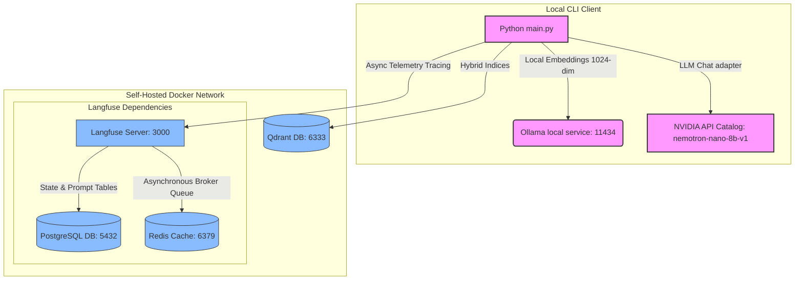
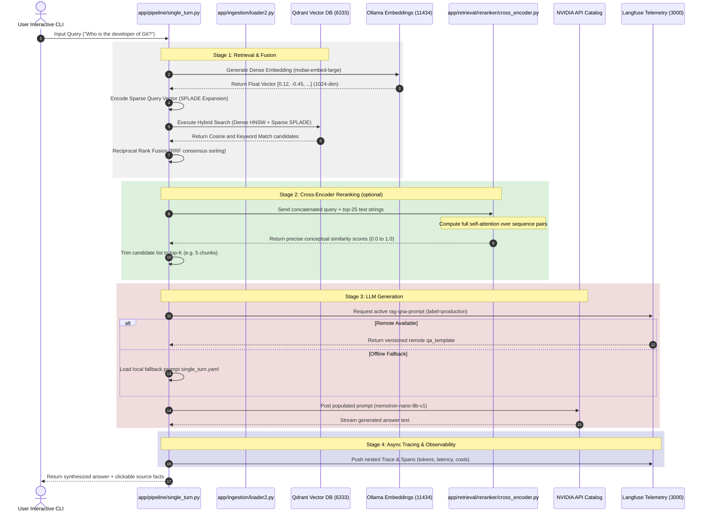

# 🧪 RAG Eval Lab: Advanced Information Retrieval & LLM Generation

Welcome to the **RAG Eval Lab** — an elite, local-first engineering playground and research sandbox designed to evaluate, test, and master modern Retrieval-Augmented Generation (RAG) pipelines.

This repository serves as a comprehensive, end-to-end curriculum for RAG engineering. Instead of using high-level drag-and-drop wrappers, this codebase is constructed from the ground up to expose the underlying **mathematics, data models, state networks, and indexing engines** of search architectures.

---

## 🏗️ 1. System Architecture

The **RAG Eval Lab** coordinates a multi-layered local client and a containerized self-hosted stack. Every service runs within a dedicated, isolated Docker virtual bridge network (`rag_network`), ensuring secure, low-latency container-to-container routing.



---

## 🔄 2. Step-by-Step Request Flow

The sequence diagram below illustrates the path a user query traverses to retrieve relevant information, synthesize a response, and trace telemetry metrics:



---

## 🎯 3. What You Will Learn

By working through this codebase and exploring the structured tutorials, you will acquire high-level, production-grade competencies in modern search and generation engineering:

* **Advanced Text Segmentation**: Construct and compare structural Fixed-Token splitters, paragraph-preserving Recursive-Character structures, NLTK-guided Sentence splitters, and semantic-breakpoint clustering using local sliding window variance.
* **Dual-Engine Hybrid Retrieval**: Interface with Qdrant natively to build and query unified collections containing dual HNSW dense vector models and lexical inverted indices.
* **Sparse Indexing & Concepts Expansion**: Implement traditional BM25 keyword matching and neural learned sparse representations (SPLADE), capturing concepts and terms absent from the physical document text.
* **Math-Based Consensus Fusion**: Implement Reciprocal Rank Fusion (RRF) in Python to mathematically merge disparate lexical and semantic lists into a single consolidated, unbiased consensus.
* **High-Accuracy Neural Reranking**: Apply Stage-2 filtering using local Cross-Encoder transformer attention layers and Cohere's enterprise REST rerank APIs, isolating relevant texts from noise.
* **Stateful Conversational Graphs**: Utilize **LangGraph** to build multi-turn session networks using `StateGraph` architectures and custom message reducers to manage token context bounds.
* **Observability Engineering**: Deploy a self-hosted telemetry stack (PostgreSQL, Redis, Langfuse) to capture nested spans, track cost margins, monitor token rates, and deploy versioned prompts remotely with offline fallbacks.

---

## ⚡ 4. Quickstart Guide

Get the **RAG Eval Lab** running on your local workstation in five steps:

### Step 1: Boot the Containerized Infrastructure
Start your private vector database and telemetry servers:
```bash
docker compose up -d
```
Verify all four services are healthy:
```bash
docker compose ps
```
* **Qdrant Dashboard**: Open `http://localhost:6333/dashboard` to view vector collections.
* **Langfuse Dashboard**: Open `http://localhost:3000` to register your administrator account, set up a project named `"RAG Eval Lab"`, and generate your API Keys.

### Step 2: Configure the Environment Secrets
Copy the template file to `.env`:
```bash
cp .env.example .env
```
Open `.env` in your IDE and fill in your keys:
* Get your free `NVIDIA_API_KEY` from [NVIDIA Build](https://build.nvidia.com).
* Paste your `LANGFUSE_PUBLIC_KEY` and `LANGFUSE_SECRET_KEY` copied from your self-hosted Langfuse dashboard.

### Step 3: Run Ollama Local Embeddings
Make sure [Ollama](https://ollama.com) is installed and running, then pull the required embedding model:
```bash
ollama pull mxbai-embed-large
```
> **Why `mxbai-embed-large`?** It produces 1024-dimensional dense vectors with the highest retrieval quality among Ollama-served models. See the embedding model reference in the root [`README.md`](../README.md).

### Step 4: Set Up Langfuse Prompts
In your Langfuse dashboard (`http://localhost:3000`), create two prompts and label each as **`production`**:

| Prompt Name | Type | Purpose |
|---|---|---|
| `rag-qna-prompt` | Chat | Single-turn Q&A template |
| `rag-conversation-prompt` | Text | Multi-turn conversation template |

The app will fetch these automatically and fall back to local YAML templates if they are unavailable.

### Step 5: Run the Interactive Sandbox
Run the entry point using the `uv` tool. On first run, this will automatically fetch any missing Wikipedia articles, construct isolated hybrid Qdrant collections, and boot an interactive CLI terminal loop:
```bash
uv run python main.py
```
> **Note:** The first run performs an idempotent Wikipedia cache fill — it only downloads articles not already in `data/wikipedia_cache/`, so re-runs are fast.

---

## 🗺️ 5. Codebase Reference Map

Navigate the codebase using the layout below, and click the direct references to read the code or study their corresponding, academically rigorous guides.

### Core Modules & Implementation Files

```text
rag-eval-lab/
├── main.py                       <-- Entry point: bootstrap, CLI loop, pipeline routing
│
├── app/
│   ├── config/
│   │   ├── settings.py           <-- Pydantic Settings & env variable validation
│   │   ├── experiment.yaml       <-- Experiment spec (toggle chunkers, models, retrievers)
│   │   └── config_loader.py      <-- Loads and validates experiment.yaml at startup
│   │
│   ├── ingestion/
│   │   ├── loader.py             <-- HotpotQA stage compiler & Wikipedia fetcher (legacy)
│   │   ├── loader2.py            <-- Cache-only DocumentLoader (no network calls)
│   │   ├── loader_helper.py      <-- Stage configs, cache paths, Wikipedia article helpers
│   │   │
│   │   ├── chunking/
│   │   │   ├── base.py           <-- Chunker ABC, ChunkingConfig, get_chunker() registry
│   │   │   ├── fixed.py          <-- Fixed-token splitter with backtracking bounds
│   │   │   ├── recursive.py      <-- Recursive-character splitting on paragraph delimiters
│   │   │   ├── sentence.py       <-- NLTK sentence boundary splits
│   │   │   └── semantic.py       <-- Embedding cosine-distance breakpoint segmentation
│   │   │
│   │   └── indexing/
│   │       ├── dense.py          <-- QdrantHybridIndexer: HNSW + sparse dual-vector setup
│   │       └── sparse.py         <-- SparseEncoder: BM25 & SPLADE neural concept weights
│   │
│   ├── retrieval/
│   │   ├── base.py               <-- BaseRetriever ABC
│   │   ├── dense.py              <-- Qdrant cosine HNSW dense retrieval
│   │   ├── sparse.py             <-- Qdrant inverted-index keyword retrieval
│   │   ├── hybrid.py             <-- RRF-fused hybrid retriever
│   │   │
│   │   └── reranker/
│   │       ├── base.py           <-- BaseReranker ABC
│   │       ├── cross_encoder.py  <-- Local Cross-Encoder transformer reranking
│   │       └── cohere.py         <-- Remote Cohere Rerank API integration
│   │
│   ├── generation/
│   │   ├── prompts/              <-- Local fallback YAML prompt templates
│   │   ├── single_turn.py        <-- CompatibleChatOpenAI + Langfuse prompt registry
│   │   └── multi_turn.py         <-- Stateful LangGraph conversational graph
│   │
│   ├── pipeline/
│   │   ├── base.py               <-- BasePipeline ABC & PipelineResult dataclass
│   │   ├── single_turn.py        <-- End-to-end single-turn pipeline (OTel span context)
│   │   └── multi_turn.py         <-- Stateful multi-turn pipeline (OTel span context)
│   │
│   ├── tracing/
│   │   └── langfuse.py           <-- Langfuse v4 SDK singleton, SpanContext, LangfuseTracer
│   │
│   └── utils/
│       ├── logger.py             <-- Structured Loguru logger
│       ├── config_loader.py      <-- experiment.yaml → ExperimentConfig dataclass
│       └── wiki_api_fetcher.py   <-- Idempotent Wikipedia article cache builder
│
├── docs/                         <-- Deep-dive educational guides (see Section 6)
├── data/
│   ├── hotpot_cache/             <-- HotpotQA QA-pair JSON files (easy/medium/hard)
│   └── wikipedia_cache/          <-- Per-article Wikipedia full-text JSON files
│
├── docker-compose.yml            <-- Qdrant + Langfuse + PostgreSQL + Redis cluster
└── .env.example                  <-- Environment variable template
```

---

## 🔧 6. Key Configuration: `experiment.yaml`

All experiment parameters are driven from a single YAML file — commit it to reproduce any run exactly:

```yaml
experiment_name: "fixed-dense-baseline-v1"

model:
  llm: "nvidia/llama-3.1-nemotron-nano-8b-v1"   # NVIDIA Catalog model
  embedding: "mxbai-embed-large"                  # Ollama local embedding
  embedding_dim: 1024
  sparse_encoder: naver/splade-cocondenser-ensembledistil

ingestion:
  chunking: fixed          # fixed | semantic | recursive | sentence
  chunk_size: 512
  chunk_overlap: 50
  stage: 1                 # 1 = ~125 QA pairs, 2 = ~1200, 3 = ~12000

retrieval:
  method: dense            # dense | sparse | hybrid
  top_k: 5
  reranker: none           # none | cross_encoder | cohere
  sparse_strategy: splade  # splade | bm25

generation:
  mode: single_turn        # single_turn | multi_turn

tracing:
  enabled: true
  session_tag: "phase1-baseline"
```

Each unique combination of `stage + chunking + sparse_strategy` creates an **isolated Qdrant collection**, so switching strategies never corrupts a previous experiment's index.

---

## 📚 7. Deep-Dive Educational Guides

Study the mechanics and mathematics behind each layer:

1. **📊 Setup & Variables Master Guide** → [docs/setup_guide.md](docs/setup_guide.md)
   * Detailed system prerequisites, Ollama setups, local service architectures, and an exhaustive guide explaining every single environment setting.
2. **🐳 Self-Hosting & Cluster Architecture** → [docs/self_hosting.md](docs/self_hosting.md)
   * Deep analysis of PostgreSQL schemas, Redis background async caches, NextAuth cryptography, and persistent Docker volumes.
3. **📊 Semantic Chunking Mathematics** → [docs/chunking/semantic.md](docs/chunking/semantic.md)
   * Full vector dot-product equations, cosine distance derivations, percentile/std-dev/IQR thresholds, and sliding window buffers.
4. **📊 Chunking Layer Masterclass** → [docs/chunking/lessons.md](docs/chunking/lessons.md)
   * In-depth comparison of Fixed, Recursive, Sentence, and Semantic strategies with token stability and CPU latency trade-off tables.
5. **📊 Retrieval & Fusion Mathematics** → [docs/retrieval/lessons.md](docs/retrieval/lessons.md)
   * HNSW graph search, BM25 TF-IDF parameters, SPLADE log-relu max-pooling, RRF consensus fusion, and Bi-Encoders vs. Cross-Encoders.
6. **📊 Generation & Tracing** → [docs/generation/lessons.md](docs/generation/lessons.md)
   * NVIDIA OpenAI adapters, Langfuse Prompt Registries, LangGraph state reducers, and async OTel observability traces.
