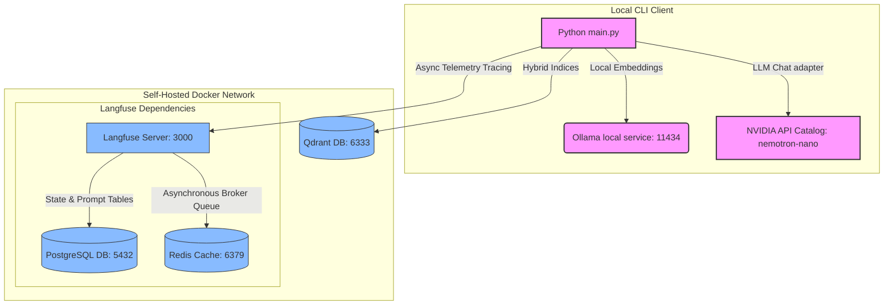
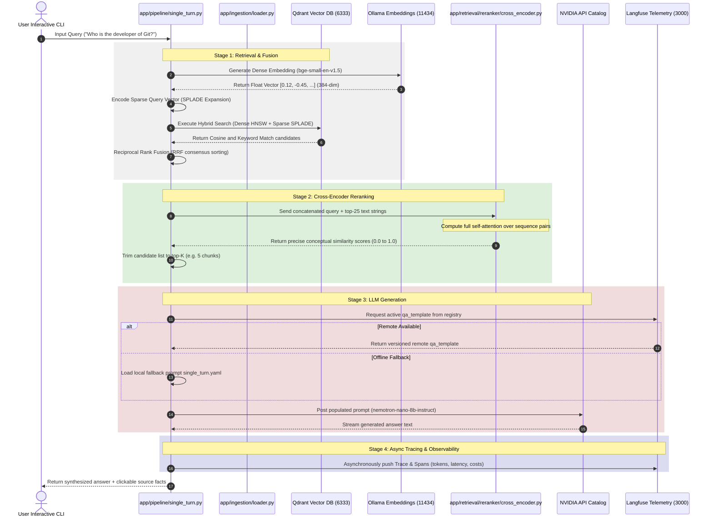

# 🧪 RAG Eval Lab: Advanced Information Retrieval & LLM Generation

Welcome to the **RAG Eval Lab** — an elite, local-first engineering playground and research sandbox designed to evaluate, test, and master modern Retrieval-Augmented Generation (RAG) pipelines. 

This repository serves as a comprehensive, end-to-end curriculum for RAG engineering. Instead of using high-level drag-and-drop wrappers, this codebase is constructed from the ground up to expose the underlying **mathematics, data models, state networks, and indexing engines** of search architectures.

---

## 🏗️ 1. System Architecture

The **RAG Eval Lab** coordinates a multi-layered local client and a containerized self-hosted stack. Every service runs within a dedicated, isolated Docker virtual bridge network (`rag_network`), ensuring secure, low-latency container-to-container routing.



---

## 🔄 2. Step-by-Step Request Flow

The sequence diagram below illustrates the path a user query traverses to retrieve relevant information, synthesize a response, and trace telemetry metrics:



---

## 🎯 3. What You Will Learn

By working through this codebase and exploring the structured tutorials, you will acquire high-level, production-grade competencies in modern search and generation engineering:

* **Advanced Text Segmentation**: Construct and compare structural Fixed-Token splitters, paragraph-preserving Recursive-Character structures, NLTK-guided Sentence splitters, and semantic-breakpoint clustering using local sliding window variance.
* **Dual-Engine Hybrid Retrieval**: Interface with Qdrant natively to build and query unified collections containing dual HNSW dense vector models and lexical inverted indices.
* **Sparse Indexing & Concepts Expansion**: Implement traditional BM25 keyword matching and neural learned sparse representations (SPLADE), capturing concepts and terms absent from the physical document text.
* **Math-Based Consensus Fusion**: Implement Reciprocal Rank Fusion (RRF) in Python to mathematically merge disparate lexical and semantic lists into a single consolidated, unbiased consensus.
* **High-Accuracy Neural Reranking**: Apply Stage-2 filtering using local Cross-Encoder transformer attention layers and Cohere's enterprise REST rerank APIs, isolating relevant texts from noise.
* **Stateful Conversational Graphs**: Utilize **LangGraph** to build multi-turn session networks using `StateGraph` architectures and custom message reducers to manage token context bounds.
* **Observability Engineering**: Deploy a self-hosted telemetry stack (PostgreSQL, Redis, Langfuse) to capture nested spans, track cost margins, monitor token rates, and deploy versioned prompts remotely with offline fallbacks.

---

## ⚡ 4. Quickstart Guide

Get the **RAG Eval Lab** running on your local workstation in five minutes:

### Step 1: Boot the Containerized Infrastructure
Start your private vector database and telemetry servers:
```bash
docker compose up -d
```
Verify all four services are healthy:
```bash
docker compose ps
```
* **Qdrant Dashboard**: Open `http://localhost:6333/dashboard` to view vector metrics.
* **Langfuse Dashboard**: Open `http://localhost:3000` to register your administrator account, set up a project named `"RAG Eval Lab"`, and generate your API Keys.

### Step 2: Configure the Environment Secrets
Copy the template file to `.env`:
```bash
cp .env.example .env
```
Open `.env` in your IDE and fill in your keys:
* Get your free `NVIDIA_API_KEY` from [NVIDIA Build](https://build.nvidia.com).
* Paste your `LANGFUSE_PUBLIC_KEY` and `LANGFUSE_SECRET_KEY` copied from your self-hosted Langfuse dashboard.

### Step 3: Run Ollama Local Embeddings
Make sure Ollama is installed and running on your system, then pull the required embedding model:
```bash
ollama pull bge-small-en-v1.5
```

### Step 4: Run the Interactive Sandbox
Run the entry point using the `uv` tool. This will automatically download Wikipedia gold sets, construct your isolated hybrid collections, ingest the documents, and boot an interactive CLI terminal loop:
```bash
uv run python main.py
```

---

## 🗺️ 5. Codebase Reference Map

Navigate the codebase using the layout below, and click the direct references to read the code or study their corresponding, academically rigorous guides.

### Core Modules & Implementation Files

```text
rag-eval-lab/
├── app/
│   ├── config/
│   │   ├── settings.py           <-- Central Pydantic Settings & Env Validation
│   │   └── experiment.yaml       <-- Experimentspec (Toggle chunkers, models, and retrievers)
│   │
│   ├── ingestion/
│   │   ├── loader.py             <-- HotpotQA stratified loaders & Wiki full-text loaders
│   │   ├── chunking/
│   │   │   ├── base.py           <-- Chunker Abstract Base Classes & Registry
│   │   │   ├── fixed.py          <-- Fixed-Token splitters with backtracking bounds
│   │   │   ├── recursive.py      <-- Recursive-Character splitting delimiters
│   │   │   ├── sentence.py       <-- NLTK sentence boundary splits
│   │   │   └── semantic.py       <-- Embedding similarity breakpoint segmentations
│   │   │
│   │   └── indexing/
│   │       ├── dense.py          <-- Qdrant named vector definitions (HNSW configurations)
│   │       └── sparse.py         <-- BM25 & SPLADE neural concept expansion weights
│   │
│   ├── retrieval/
│   │   ├── base.py               <-- ABC Retriever Interface definition
│   │   ├── dense.py              <-- Qdrant continuous cosine vector retrievals
│   │   ├── sparse.py             <-- Lexical matching on inverted indices
│   │   ├── hybrid.py             <-- RRF-fused combined retrievers
│   │   │
│   │   └── reranker/
│   │       ├── base.py           <-- Rerank interface standard
│   │       ├── cross_encoder.py  <-- Local concatenated transformer self-attention
│   │       └── cohere.py         <-- Remote hosted Cohere Rerank API integrations
│   │
│   ├── generation/
│   │   ├── prompts/              <-- Local Fallback YAML templates
│   │   ├── single_turn.py        <-- NVIDIA OpenAI adapter & Remote/Local Prompt engines
│   │   └── multi_turn.py         <-- Stateful conversational graphs using LangGraph
│   │
│   ├── pipeline/
│   │   ├── single_turn.py        <-- End-to-end single question routing (with full spans)
│   │   └── multi_turn.py         <-- Multi-turn stateful conversational pipelines
│   │
│   └── main.py                   <-- Interactive terminal CLI controller
```

---

### Deep-Dive Educational Guides

Study the mechanics and mathematics behind each layer in these detailed guides:

1. **📊 Setup & Variables Master Guide** $\rightarrow$ [docs/setup_guide.md](file:///c:/Users/23add/workspace/pocket-projects/rag-eval-lab/docs/setup_guide.md)
   * Detailed system prerequisites, Ollama setups, local service architectures, and an exhaustive guide explaining every single environment setting.
2. **🐳 Self-Hosting & Cluster Architecture** $\rightarrow$ [docs/self_hosting.md](file:///c:/Users/23add/workspace/pocket-projects/rag-eval-lab/docs/self_hosting.md)
   * Deep analysis of PostgreSQL schemas, Redis background async caches, NextAuth cryptography, and volumes.
3. **📊 Semantic Chunking Mathematics** $\rightarrow [docs/chunking/semantic.md](file:///c:/Users/23add/workspace/pocket-projects/rag-eval-lab/docs/chunking/semantic.md)
   * Full vector dot-product equations, magnitudes, cosine distance derivations, 2D vector numerical tracking, percentile/std-dev/IQR thresholds, and sliding window buffers.
4. **📊 Chunking Layer Masterclass** $\rightarrow$ [docs/chunking/lessons.md](file:///c:/Users/23add/workspace/pocket-projects/rag-eval-lab/docs/chunking/lessons.md)
   * In-depth comparison of Fixed, Recursive, Sentence, and Semantic strategies with token stability and CPU latency trade-off tables.
5. **📊 Retrieval & Fusion Mathematics** $\rightarrow$ [docs/retrieval/lessons.md](file:///c:/Users/23add/workspace/pocket-projects/rag-eval-lab/docs/retrieval/lessons.md)
   * Explaining HNSW graph search, BM25 TF-IDF parameters, neural learned SPLADE log-relu max-pooling, RRF consensus fusion (with a complete table walkthrough), and Bi-Encoders vs. Cross-Encoders.
6. **📊 Generation & Tracing** $\rightarrow$ [docs/generation/lessons.md](file:///c:/Users/23add/workspace/pocket-projects/rag-eval-lab/docs/generation/lessons.md)
   * OpenAI adapters, Langfuse Prompt Registries, stateful LangGraph state message reducers, and async observability traces.
