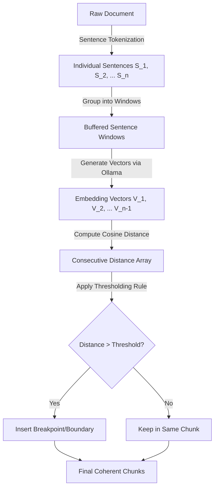

# 🧠 Semantic Chunking: The Mathematics of Meaning-Based Splitting

In modern retrieval-augmented generation (RAG), traditional structural chunking splitters (fixed size, character limits, or sentence boundaries) slice text based on **physical constraints** rather than **logical continuity**. 

**Semantic Chunking** is an intelligent, context-aware alternative. Instead of asking: *"Has this chunk reached 512 tokens?"*, it asks: **"Has the topic changed significantly enough to warrant a boundary?"**

---

## 1. Algorithmic Overview

The semantic chunking workflow scanning a document is represented sequentially as follows:



1. **Sentence Tokenization**: The document is split into individual sentences using natural language delimiters (e.g., periods, question marks, and exclamation points).
2. **Buffer Windowing (Smoothing)**: Rather than comparing single isolated sentences (which are highly noisy and prone to erratic semantic jumps), sentences are grouped into overlapping windows of size $w$ (e.g., $w = 3$).
3. **Embedding Vectorization**: Each buffered sentence window is converted into a high-dimensional continuous vector space using an embedding model (e.g., `bge-small-en-v1.5` via Ollama).
4. **Consecutive Distance Calculation**: We compute the semantic distance between each consecutive pair of sentence window embeddings.
5. **Thresholding (Breakpoint Detection)**: We identify mathematical outliers in the distance sequence. These outliers represent significant shifts in subject matter (breakpoints), where new chunks are spawned.

---

## 2. Mathematical Foundations

To measure how similar or different two sentence windows are, we treat their embeddings as vectors in a multi-dimensional space and compute their **Cosine Similarity** and subsequent **Cosine Distance**.

### Cosine Similarity
Given two embedding vectors $\mathbf{a}$ and $\mathbf{b}$ of dimension $d$, the Cosine Similarity measures the cosine of the angle $\theta$ between them. This focuses purely on **direction** rather than **magnitude**:

$$\text{Cosine Similarity}(\mathbf{a}, \mathbf{b}) = \cos(\theta) = \frac{\mathbf{a} \cdot \mathbf{b}}{\|\mathbf{a}\| \|\mathbf{b}\|} = \frac{\sum_{i=1}^d a_i b_i}{\sqrt{\sum_{i=1}^d a_i^2} \sqrt{\sum_{i=1}^d b_i^2}}$$

Where:
* $\mathbf{a} \cdot \mathbf{b}$ is the dot product of the two vectors.
* $\|\mathbf{a}\|$ and $\|\mathbf{b}\|$ represent the Euclidean $L_2$ norms (magnitudes) of the vectors.

### Cosine Distance
To represent this similarity as a distance metric (where a **higher value** indicates **greater dissimilarity**), we subtract the similarity score from $1$:

$$\text{Cosine Distance}(\mathbf{a}, \mathbf{b}) = 1 - \text{Cosine Similarity}(\mathbf{a}, \mathbf{b})$$

* **Distance $\approx 0.0$**: The sentence windows are semantically identical.
* **Distance $\approx 1.0$**: The sentence windows are orthogonal (entirely unrelated).
* **Distance $\approx 2.0$**: The sentence windows point in opposite directions (diametrically opposed meanings).

---

## 3. Step-by-Step Hand-Evaluated Vector Example

Let us trace a simplified, 2-dimensional vector space example. Suppose we have 4 sequential sentences:

* **$S_1$**: "LangChain simplifies building LLM orchestrations."
* **$S_2$**: "It handles complex prompt templates and chains."
* **$S_3$**: "Vector databases optimize rapid semantic indexing."
* **$S_4$**: "Qdrant stores dense vectors for similarity search."

Assume our embedding model yields the following 2D vectors:
* $\mathbf{V_1} = [0.90, 0.15]$ (Context: LLM Software)
* $\mathbf{V_2} = [0.85, 0.20]$ (Context: LLM Software)
* $\mathbf{V_3} = [0.18, 0.88]$ (Context: Vector Storage)
* $\mathbf{V_4} = [0.15, 0.92]$ (Context: Vector Storage)

We calculate the distance between consecutive neighbors: $\mathbf{V_1} \leftrightarrow \mathbf{V_2}$, $\mathbf{V_2} \leftrightarrow \mathbf{V_3}$, and $\mathbf{V_3} \leftrightarrow \mathbf{V_4}$.

---

### Transaction 1: $\mathbf{V_1} \leftrightarrow \mathbf{V_2}$

#### A. Dot Product
$$\mathbf{V_1} \cdot \mathbf{V_2} = (0.90 \times 0.85) + (0.15 \times 0.20) = 0.765 + 0.030 = 0.795$$

#### B. Magnitudes ($L_2$ Norms)
$$\|\mathbf{V_1}\| = \sqrt{0.90^2 + 0.15^2} = \sqrt{0.81 + 0.0225} = \sqrt{0.8325} \approx 0.9124$$
$$\|\mathbf{V_2}\| = \sqrt{0.85^2 + 0.20^2} = \sqrt{0.7225 + 0.04} = \sqrt{0.7625} \approx 0.8732$$

#### C. Cosine Similarity
$$\cos(\theta_{1,2}) = \frac{0.795}{0.9124 \times 0.8732} = \frac{0.795}{0.7967} \approx 0.9979$$

#### D. Cosine Distance
$$\text{Distance}_{1,2} = 1 - 0.9979 = 0.0021$$

> [!NOTE]
> The distance is extremely close to $0.0$, indicating that $S_1$ and $S_2$ are part of the exact same semantic topic.

---

### Transaction 2: $\mathbf{V_2} \leftrightarrow \mathbf{V_3}$

#### A. Dot Product
$$\mathbf{V_2} \cdot \mathbf{V_3} = (0.85 \times 0.18) + (0.20 \times 0.88) = 0.153 + 0.176 = 0.329$$

#### B. Magnitudes ($L_2$ Norms)
$$\|\mathbf{V_2}\| \approx 0.8732$$
$$\|\mathbf{V_3}\| = \sqrt{0.18^2 + 0.88^2} = \sqrt{0.0324 + 0.7744} = \sqrt{0.8068} \approx 0.8982$$

#### C. Cosine Similarity
$$\cos(\theta_{2,3}) = \frac{0.329}{0.8732 \times 0.8982} = \frac{0.329}{0.7843} \approx 0.4195$$

#### D. Cosine Distance
$$\text{Distance}_{2,3} = 1 - 0.4195 = 0.5805$$

> [!IMPORTANT]
> The distance jumps to $0.5805$, showing a strong semantic shift between software libraries and vector storage.

---

### Transaction 3: $\mathbf{V_3} \leftrightarrow \mathbf{V_4}$

#### A. Dot Product
$$\mathbf{V_3} \cdot \mathbf{V_4} = (0.18 \times 0.15) + (0.88 \times 0.92) = 0.027 + 0.8096 = 0.8366$$

#### B. Magnitudes ($L_2$ Norms)
$$\|\mathbf{V_3}\| \approx 0.8982$$
$$\|\mathbf{V_4}\| = \sqrt{0.15^2 + 0.92^2} = \sqrt{0.0225 + 0.8464} = \sqrt{0.8689} \approx 0.9321$$

#### C. Cosine Similarity
$$\cos(\theta_{3,4}) = \frac{0.8366}{0.8982 \times 0.9321} = \frac{0.8366}{0.8372} \approx 0.9993$$

#### D. Cosine Distance
$$\text{Distance}_{3,4} = 1 - 0.9993 = 0.0007$$

---

### Collected Distances
Our consecutive distance sequence is:
$$\mathbf{D} = [0.0021, 0.5805, 0.0007]$$

If we establish a semantic distance threshold of $0.30$, any consecutive distance exceeding $0.30$ triggers a **breakpoint**.
* $\text{Distance}_{1,2} = 0.0021 < 0.30$ (No split)
* $\text{Distance}_{2,3} = 0.5805 \ge 0.30$ (**BREAKPOINT DETECTED!**)
* $\text{Distance}_{3,4} = 0.0007 < 0.30$ (No split)

#### Output Chunks:
* **Chunk 1**: $S_1 + S_2$ ("LangChain simplifies building LLM orchestrations. It handles complex prompt templates and chains.")
* **Chunk 2**: $S_3 + S_4$ ("Vector databases optimize rapid semantic indexing. Qdrant stores dense vectors for similarity search.")

---

## 4. Breakpoint Thresholding Strategies

How do we dynamically determine the threshold for a document, given that different texts have different structural flow and vocabulary densities? LangChain supports three distinct mathematical thresholding strategies:

| Threshold Strategy | Mathematical Rule | Description | Best Use Cases |
| :--- | :--- | :--- | :--- |
| **Percentile** | $T = P_x(\mathbf{D})$ | Splits at the top $100-x$ percentage of distances. E.g., at $95\%$, it splits the 5% largest jumps. | General documents with predictable topic counts. |
| **Standard Deviation** | $T = \mu + k \cdot \sigma$ | Threshold is $k$ standard deviations ($\sigma$) above the mean distance ($\mu$). | Documents with highly consistent paragraph lengths. |
| **Interquartile Range (IQR)** | $T = Q_3 + k \cdot \text{IQR}$ | Threshold is $k$ times the IQR above the 75th percentile ($Q_3$). Resistant to outliers. | Messy, noisy documents or OCR-extracted texts. |

---

### A. Percentile Strategy (Adaptive Rank)
The most common production strategy. You choose a percentile (e.g., $90\%$). 
1. Sort the distances in ascending order.
2. Find the distance at the 90th percentile.
3. Every transition with a distance greater than this value is a split.

* **Pros**: Guarantees that a fixed percentage of transitions will split, preventing extremely massive single chunks in very long texts.
* **Cons**: If a document has only one uniform topic, it will still force splits where no real topic changes exist.

---

### B. Standard Deviation Strategy (Statistical Variance)
We analyze the global mean ($\mu$) and standard deviation ($\sigma$) of the distance sequence:

$$\mu = \frac{1}{N}\sum_{i=1}^N D_i, \quad \sigma = \sqrt{\frac{1}{N}\sum_{i=1}^N (D_i - \mu)^2}$$

The threshold is set as:
$$T = \mu + k \cdot \sigma$$

*Usually, $k = 1.2$ or $1.5$ is chosen.*
* **Pros**: Highly statistical. If the document has highly uniform topics, the variance $\sigma$ is small, preventing unnecessary splits.
* **Cons**: A single massive outlier distance (e.g., an abrupt advertisement page or legal disclaimer) spikes both $\mu$ and $\sigma$, which raises the threshold too high and prevents other real topic boundaries from being detected.

---

### C. Interquartile Range (IQR) Strategy (Outlier-Resistant)
To combat the outlier distortion of standard deviation, we use the Interquartile Range:
1. Divide distances into quartiles: $Q_1$ (25th percentile), $Q_2$ (50th/Median), and $Q_3$ (75th percentile).
2. Calculate the IQR (the middle 50% spread):
   $$\text{IQR} = Q_3 - Q_1$$
3. The upper fence threshold is defined as:
   $$T = Q_3 + k \cdot \text{IQR}$$

*Typically, $k = 1.5$ (mild outliers) or $k = 3.0$ (extreme outliers).*
* **Pros**: Highly robust. Because $Q_1$ and $Q_3$ are rank-based, extreme single-point shifts cannot distort the boundary threshold.
* **Cons**: Slightly more computationally expensive to sort and extract quantiles, though negligible for standard text lengths.

---

## 5. Local Sentence Buffering (Smoothing Window)

In real systems, individual sentences are highly variable. Consider these sequential lines:
1. *"He opened the door."*
2. *"It was raining outside."*
3. *"The cat ran out."*

Each sentence is short, and their individual embeddings might reside in completely different sectors of the vector space, creating massive local distance spikes even though they form a single cohesive narrative.

### The Solution: Buffered Sliding Windows
To stabilize topic shifts, we generate the embedding of sentence $S_i$ by concatenating it with its surrounding neighbors:

$$\text{Buffer}_i = [ S_{i-w}, \dots, S_i, \dots, S_{i+w} ]$$

Where $w$ is the buffer size. For a buffer size of $1$, $\text{Buffer}_i$ is the concatenated string of:
$$S_{i-1} + S_i + S_{i+1}$$

We then embed these concatenated strings and compute similarity between $\text{Buffer}_i$ and $\text{Buffer}_{i+1}$.

```text
Without Buffering (Noisy):
S1 ──> V1 ──┐
            ├── Distance = 0.52 (Spike!)
S2 ──> V2 ──┘

With Buffering (Smooth):
[S1 + S2] ──> BufferVector1 ──┐
                              ├── Distance = 0.08 (Stable)
[S2 + S3] ──> BufferVector2 ──┘
```

This acts as a low-pass filter over the semantic space, smoothing out grammatical fluctuations and capturing pure topic transitions.
