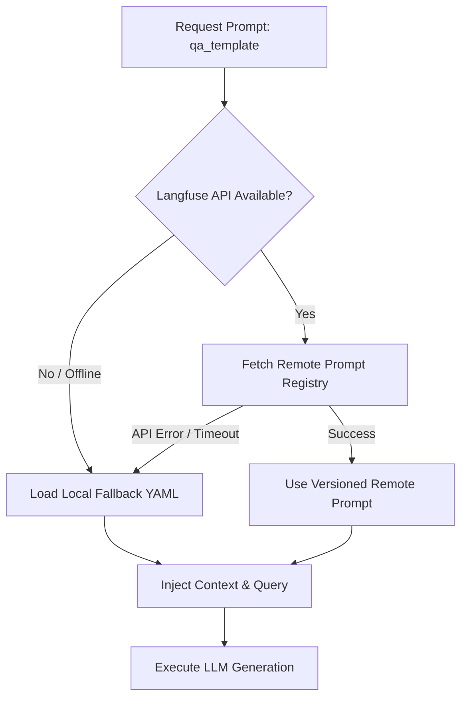
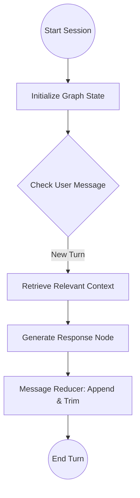

# 📚 Generation, memory & Tracing: Orchestration & Observability

Once the retrieval layer surfaces the most relevant document chunks, the **Generation Layer** must synthesize a final answer. This involves piping context and queries to the LLM, managing prompt templates, maintaining conversation state over multiple turns, and tracing every action for evaluation.

This guide explores the design, state graphs, and observability mechanisms implemented in our **Generation Layer**.

---

## 1. NVIDIA API Integration via OpenAI Adapter

To access state-of-the-art instructed models (e.g., `llama-3.1-nemotron-nano-8b-instruct`), we use the **NVIDIA API** hosted on `build.nvidia.com`. 

### OpenAI Compatibility
Instead of maintaining separate custom API adapters for every LLM vendor, modern providers (like NVIDIA) supply **OpenAI-compatible endpoints**. These endpoints adhere to the exact same JSON schemas and HTTP request/response payloads as OpenAI's standard endpoints.

In Python, we simply initialize the standard `openai` library but redirect its routing:
```python
from openai import OpenAI

client = OpenAI(
    base_url="https://integrate.api.nvidia.com/v1",  # Point away from OpenAI
    api_key=settings.nvidia_api_key                 # Inject NVIDIA API Key
)
```
This enables seamless drop-in integration without changes to our prompting pipelines.

---

## 2. Dual-Source Prompt Management

Prompts are the critical instructions that guide LLM behaviors. Updating prompt templates directly in the code requires re-deploying the application, which is highly inefficient. 

To solve this, the **RAG Eval Lab** implements a **Dual-Source Prompt Registry**:



### A. Remote Prompt Registry (Langfuse)
* **What it is**: Langfuse provides a hosted Prompt Registry.
* **Why we use it**: Developers can edit, version-control, and tag prompts (e.g., `"production"`, `"staging"`) inside a browser UI. When our Python pipeline starts, it requests the prompt by its identifier. The system dynamically pulls the active prompt at runtime, enabling instant instruction tweaks without code changes.

### B. Local YAML Fallback (Offline Resilience)
* **Why it is critical**: If the Langfuse server is offline, your local API key is revoked, or you are running evaluations in a disconnected environment, the application must not crash.
* **The mechanism**: If the remote retrieval fails, the pipeline catches the exception, outputs a warning log, and instantly reads the fallback YAML template stored in the local codebase under `app/generation/prompts/single_turn.yaml`.

---

## 3. Stateful Conversational graphs (LangGraph)

For single-turn Q&A, a stateless API request is sufficient. However, complex multi-turn sessions (where the user asks follow-up questions) require maintaining state and chat history. Naive memory loops simply append text to a list, which quickly fills the LLM context window.

We use **LangGraph** to build a robust, state-controlled conversational network.



### A. The StateGraph Concept
A state graph defines a conversational session as a mathematical network of nodes (functions) and edges (control links) passing a single shared database: the **State**.
In our `multi_turn.py` graph, the State is represented as a subclass of `TypedDict`:

```python
from typing import Annotated, Sequence
from typing_extensions import TypedDict
from langchain_core.messages import BaseMessage
from langgraph.graph.message import add_messages

class ConversationState(TypedDict):
    # add_messages is a state reducer that automatically appends new messages
    messages: Annotated[Sequence[BaseMessage], add_messages]
    context_chunks: list[str]  # currently retrieved documents
```

### B. State Reducers & Context Trimming
The `Annotated[..., add_messages]` declaration is a **reducer**. In standard state management, updating a state variable overwrites the old value completely. A reducer is a function that defines how updates are merged. The `add_messages` reducer:
1. If the update contains a new message with a unique ID, it appends it to the history.
2. If the update contains an existing message ID, it overwrites the contents (useful for editing past chat bubbles).
3. If the chat history grows too long, the reducer can automatically **trim** old messages, keeping only the last $N$ messages to prevent context window overflow and contain API token costs.

---

## 4. Telemetry Observability Tracing

To debug, optimize, and evaluate RAG systems, developers need complete visibility into every internal step. A simple log statement cannot capture the nested, asynchronous relationships of a real-world pipeline run.

We implement automated, nested **observability tracing** using Langfuse:

```text
Trace: RAG Pipeline Run (Trace ID: x78f-9a1b)
 ├── Span: Load Ingestion Config (Time: 2ms)
 ├── Span: Document Ingestion & Vector Indexing (Time: 1250ms)
 ├── Span: Core Retrieval Layer (Time: 145ms)
 │    ├── Span: Dense HNSW Search (Time: 23ms)
 │    ├── Span: Sparse SPLADE Expansion (Time: 82ms)
 │    └── Span: Reciprocal Rank Fusion (Time: 4ms)
 ├── Span: Cross-Encoder Reranking (Time: 310ms)
 └── Span: LLM Response Generation (Time: 1850ms)
      └── Metric: input_tokens: 1245, output_tokens: 340, cost: $0.00045
```

### Spans vs. Traces
* **Trace**: The overall execution representing a complete user request (e.g., a single question-to-answer run).
* **Span**: A nested task or sub-operation inside that trace. Spans can have child spans (e.g., the Hybrid Retrieval span contains nested Dense and Sparse search spans).

### Metrics Captured
Every span asynchronously records:
- **Timestamp Boundaries**: Instantaneous start/end timestamps to pinpoint latency bottlenecks.
- **Input & Output Payloads**: The exact prompts and responses exchanged.
- **Token Counts & Model Identifiers**: Logged parameters to calculate real-world costs.
- **Context Metadata**: Stage tags (e.g., `stage-1`), active chunk size, and reranker choices to compare downstream performance in dashboards.
