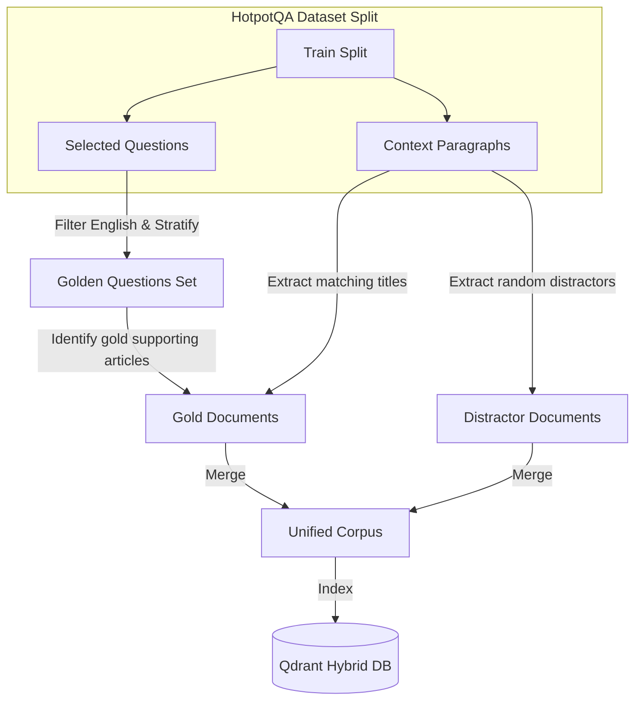

# 📚 RAG Ingestion & Indexing: Deep-Dive Lessons

This guide provides an academic and engineering deep-dive into the core concepts, mathematical foundations, and database architectures behind the **Ingestion Layer** of our RAG Eval Lab. 

---

## 1. Loader Layer: Golden Dataset & Corpus Alignment

Evaluating a RAG system requires a **Golden Dataset** (questions, ground-truth answers, and reference facts) and an **Indexed Corpus** (the searchable library of documents). 



### The Symmetrical Corpus Construction
In academic RAG evaluation (using datasets like **HotpotQA**), a standard pitfall is random corpus sampling. If you randomly select $N$ articles from Wikipedia, they will almost certainly **not** contain the specific documents needed to answer your evaluation questions. 

To solve this, we construct our corpus **symmetrically**:
1. We filter the HotpotQA training split for English-only questions.
2. We select a question set stratified by **difficulty** (Easy, Medium, Hard) and **type** (Bridge, Comparison) to hit our exact stage targets (e.g., 125 questions for Stage 1).
3. We examine the `supporting_facts` of these selected questions and retrieve the **exact Wikipedia articles (gold documents)** that contain the answers.
4. We insert these gold documents into our corpus, then pad the remaining capacity with other Wikipedia articles (distractors) to reach the exact stage size (e.g., 500 articles for Stage 1).

This guarantees that **100% of the golden questions have their ground-truth documents in the index**, turning the evaluation into a rigorous test of the retriever's ability to find the needle in a haystack of distractors.

### Question Typologies & Retrieval Stress Tests
* **Bridge Questions**: These require sequential reasoning. To answer, the retriever must find "Doc A," extract a connecting entity, and use it to find "Doc B." 
* **Comparison Questions**: These compare two distinct entities across documents (e.g., *"Who is older, the creator of Linux or the developer of Git?"*). 
  * **Why it's brutal for RAG**: The retriever must surface **both** distinct documents in its top-K results simultaneously. If the dense retriever only finds one, the generator cannot compare them, and the answer fails. This is where **Hybrid Retrieval** (combining semantic and keyword search) becomes essential.

---

## 2. Sparse vs. Dense Indexing

Retrieval strategies are broadly split into two paradigms: **Dense Semantic** and **Sparse Lexical**.

```
Dense Embedding:
["text chunk"] ──(Ollama BAAI BGE)──> [ 0.12, -0.45, 0.89, -0.01, ... ]  (384-dim continuous float array)

Sparse Vector:
["text chunk"] ──(SPLADE Encoder)──> { "linux": 1.45, "creator": 0.88, "torvalds": 2.10 } (vocabulary token weights map)
```

### Dense Retrieval (Semantic Search)
* **How it works**: A deep learning model (like `bge-small-en-v1.5` via Ollama) compresses a chunk of text into a high-dimensional, continuous vector space (384 dimensions).
* **Mathematical Similarity**: We calculate the similarity between two vectors using **Cosine Similarity**:
  $$\text{Cosine Similarity}(\mathbf{a}, \mathbf{b}) = \frac{\mathbf{a} \cdot \mathbf{b}}{\|\mathbf{a}\| \|\mathbf{b}\|} = \frac{\sum_{i=1}^n a_i b_i}{\sqrt{\sum_{i=1}^n a_i^2} \sqrt{\sum_{i=1}^n b_i^2}}$$
* **Strength**: Understands synonyms and concepts. It will match `"canine"` to `"dog"` even if they share zero characters.
* **Weakness**: Fails at exact numbers, product codes, rare names (e.g., matching `"Model-X10"` to `"Model-X11"` because their semantic vectors are nearly identical).

### Sparse Retrieval (Lexical Search)
* **How it works**: Matches specific words (tokens) from the vocabulary.
* **Mathematical Weighting (BM25)**: Calculates term importance using a frequency-based curve:
  $$\text{Score}(D, Q) = \sum_{i=1}^n IDF(q_i) \cdot \frac{f(q_i, D) \cdot (k_1 + 1)}{f(q_i, D) + k_1 \cdot \left(1 - b + b \cdot \frac{|D|}{\text{avgdl}}\right)}$$
  Where:
  * $f(q_i, D)$ is the frequency of word $q_i$ in document $D$.
  * $|D|$ and $\text{avgdl}$ are the document length and average document length.
  * $k_1$ (controls term frequency saturation) and $b$ (controls document length normalization) are tuning parameters.
  * $IDF(q_i)$ is the Inverse Document Frequency, penalizing common words (like "the") and boosting rare words:
    $$IDF(q_i) = \ln\left(1 + \frac{N - n(q_i) + 0.5}{n(q_i) + 0.5}\right)$$
* **Strength**: Extremely precise for codes, numbers, names, and exact matches.
* **Weakness**: Vocabulary mismatch. Cannot match `"dog"` to `"canine"`.

---

## 3. SPLADE: Neural Learned Sparse Search

**SPLADE (Sparse Lexical and Expansion)** is a revolutionary breakthrough that combines the best of both worlds. It uses a neural network to produce a sparse vector.

### The Problem with Traditional BM25
Traditional BM25 only counts exact words that are physically present in the text. It cannot perform synonyms or expand concepts.

### How SPLADE Solves It
SPLADE takes a BERT-style model (specifically trained for Masked Language Modeling) and uses it to predict token importances over the **entire BERT vocabulary** (typically 30,522 tokens) for a given text chunk.

```
Input Text: "Linus Torvalds created Linux."

SPLADE Neural Model
   ├── Identifies important physical terms: "linux" (weight: 2.5), "torvalds" (weight: 3.1)
   └── Performs Concept Expansion:         "git" (weight: 1.8), "software" (weight: 1.2), "programmer" (weight: 0.9)

Output Sparse Vector:
{
  "linux": 2.5,
  "torvalds": 3.1,
  "git": 1.8,
  "software": 1.2,
  "programmer": 0.9
}
```

### The SPLADE Mathematics
SPLADE passes text through a BERT model to get the logit output $x_{ij}$ for each token $j$ at each sequence position $i$. 
1. **Activation**: We apply a **Rectified Linear Unit (ReLU)** and log scaling to ensure weights are non-negative and mathematically saturated:
   $$w_{ij} = \log(1 + \max(0, x_{ij}))$$
2. **Sequence Pooling**: We perform **Max Pooling** across all sequence positions (words in the text) to find the maximum importance weight of each vocabulary token $j$ across the entire text:
   $$\mathbf{w}_j = \max_{i \in \text{sequence}} w_{ij}$$
3. **Sparsity Constraint**: During training, a regularization penalty (like FLOPS or $L_1$ regularization) is applied to force the model to keep $95\%+$ of the vocabulary weights at exactly $0$.

### Why SPLADE is Perfect for Qdrant
In traditional BM25, adding a document shifts the global document counts, meaning the IDF values of all words must technically be recalculated. 

SPLADE, being a self-contained neural model, predicts term importance **on a per-document basis**. The output is a clean dictionary of `{token_id: weight}`. We can write these sparse weights directly to Qdrant. Qdrant indexes them under its inverted index, providing lightning-fast semantic retrieval using sparse metrics!

---

## 4. Qdrant Native Hybrid Search & RRF

In a production environment, running two separate database queries (one dense, one sparse) and merging them in Python is highly inefficient. It increases network latency, doubles serialization overhead, and complicates deployment.

**Qdrant Native Hybrid Search** solves this by storing both vectors in the **same collection** and performing a single-roundtrip unified lookup.

```
Incoming Query ──> [Encode Dense & Sparse]
                         │
                         ▼
             ┌─────────────────────────┐
             │  Qdrant Search Engine   │
             │                         │
             │   Dense HNSW Index      │ ──> Vector Similarity Scores
             │          +              │
             │   Sparse Inverted Index │ ──> Lexical Scores
             └─────────────────────────┘
                         │
                         ▼
             [Reciprocal Rank Fusion (RRF)]
                         │
                         ▼
               Top-K Consolidated Nodes
```

### Collection Schema Design
To enable hybrid lookups, we configure the Qdrant collection with two named vector definitions:
1. **Dense configuration** (Default):
   * Size: 384 dimensions.
   * Distance Metric: `Cosine`.
2. **Sparse configuration** (Named `"sparse"`):
   * Storage: An inverted index with standard pruning.

### Reciprocal Rank Fusion (RRF)
When Qdrant retrieves candidates from the dense index and sparse index, the scores are not on the same scale (dense is cosine similarity $-1$ to $1$, while sparse can be unbounded log-likelihoods). We cannot simply add them.

Instead, we use **Reciprocal Rank Fusion (RRF)**. RRF ignores the raw score values and focuses purely on the **rank** (position) of the document in each search result.

The RRF score for a document $d$ is:
$$\text{RRF\_Score}(d \in D) = \sum_{m \in M} \frac{1}{k + r_m(d)}$$
Where:
* $M$ is the set of retrieval methods (in our case, `[dense, sparse]`).
* $r_m(d)$ is the rank of document $d$ (1-indexed position) in method $m$.
* $k$ is a smoothing constant (standard industry default is $60$), which prevents high ranks (e.g. Rank 1) from completely dominating the score.

#### Example of RRF:
Suppose we query a document:
* Dense Retrieval places Document A at **Rank 2**.
* Sparse Retrieval places Document A at **Rank 5**.

Using $k = 60$:
$$\text{RRF\_Score}(\text{Doc A}) = \frac{1}{60 + 2} + \frac{1}{60 + 5} = \frac{1}{62} + \frac{1}{65} \approx 0.0161 + 0.0153 = 0.0314$$

Qdrant performs this calculation natively on the database server, returning a beautifully consolidated list of the top-K nodes with single-digit millisecond latency!
