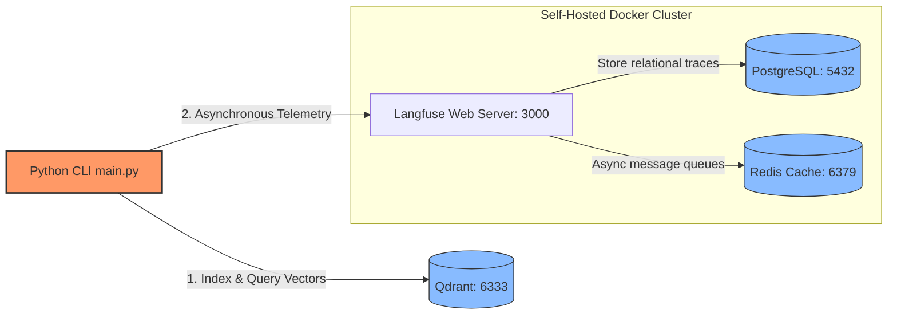

# ⚙️ Prerequisites, Local Hosting & Environment Variables Master Guide

This guide provides a comprehensive step-by-step setup manual to bootstrap the **RAG Eval Lab** environment, install required dependencies, start localized background services, configure API connections, and understand every configuration setting.

---

## 1. System Prerequisites

Before launching the pipeline, ensure your local workstation has the following three dependencies installed:

1. **Docker Desktop** (or Docker Engine with compose):
   * Required to host the state database, in-memory queue, and trace servers.
   * [Download Docker Desktop](https://www.docker.com/products/docker-desktop/)
2. **Python 3.11+ (Managed via `uv`)**:
   * We use `uv` for lightning-fast package dependency management and virtual environments.
   * Install `uv` via terminal:
     ```powershell
     # Windows (PowerShell)
     powershell -ExecutionPolicy ByPass -c "irm https://astral.sh/uv/install.ps1 | iex"
     ```
     ```bash
     # Linux / macOS
     curl -LsSf https://astral.sh/uv/install.sh | sh
     ```
3. **Ollama**:
   * Required to run embedding models locally on your GPU or CPU.
   * [Download Ollama for Windows/Linux/macOS](https://ollama.com/)

---

## 2. Local Embeddings Setup (Ollama)

Our ingestion and retrieval layers rely on the highly efficient embedding model `bge-small-en-v1.5` served locally via Ollama. 

### Step 1: Start the Ollama Service
Once Ollama is installed, verify it is running in your taskbar or terminal. Alternatively, run:
```bash
ollama serve
```

### Step 2: Download the Embedding Model
Open a new terminal window and run:
```bash
ollama pull bge-small-en-v1.5
```
*This downloads the weights for the BAAI BGE model (~130MB). Once downloaded, Ollama handles local model serving automatically.*

### Step 3: Verify the Model is Active
To confirm the model is loaded and ready, run:
```bash
ollama list
```
You should see `bge-small-en-v1.5` in the output.

---

## 3. Remote LLM API Credentials

To generate responses, the lab uses the high-speed **NVIDIA API Catalog** (which is 100% OpenAI-compatible).

### Step 1: Obtain a Free NVIDIA API Key
1. Go to [NVIDIA Build API Catalog](https://build.nvidia.com).
2. Sign up for a free developer account (you receive free initial API credits).
3. Search for the model **`llama-3.1-nemotron-nano-8b-instruct`** or a similar model.
4. Click **Get API Key** and copy the resulting string (looks like `nvapi-xxxxxxxxxxxxxxxxxxxxxxxxxxxxxxxxxxxx`).

---

## 4. Self-Hosted Infrastructure Stack (Docker Compose)

Our lab runs a fully private, localized storage and tracing stack containerized via Docker Compose.



To boot the entire local stack (PostgreSQL, Redis, Qdrant, and Langfuse), navigate to the root directory where `docker-compose.yml` is located and run:

```bash
docker compose up -d
```
* The `-d` flag boots all services in "detached" daemon mode.
* Qdrant will mount a persistent storage folder at `rag-eval-lab/qdrant_storage` to ensure your indexed stages survive system restarts.
* The self-hosted **Langfuse Observability Server** runs on `http://localhost:3000`.

---

## 5. Master Environment Variables Reference

When your application starts, `app/config/settings.py` loads its parameters using a central **Pydantic Settings** model. These parameters can be set as system environment variables or configured locally inside a `.env` file.

Copy the `.env.example` file to `.env` in the root of the project:
```bash
cp .env.example .env
```

Here is a comprehensive breakdown of every configuration variable:

| Environment Variable | Data Type | Default Value | Role / Description | Recommended Value | When & Why to Set It |
| :--- | :--- | :--- | :--- | :--- | :--- |
| **`NVIDIA_API_KEY`** | `String` | *None (Required)* | The authorization secret key for NVIDIA API Catalog model access. | `nvapi-xxxxxx...` | **Required.** Must be configured immediately after signup to execute any generation pipeline. |
| **`NVIDIA_BASE_URL`** | `URL` | `https://integrate.api.nvidia.com/v1` | The OpenAI-compatible API base URL point for LLM interactions. | `https://integrate.api.nvidia.com/v1` | Keep default unless pointing to a local mock server or custom enterprise proxy endpoint. |
| **`NVIDIA_MODEL`** | `String` | `nvidia/llama-3.1-nemotron-nano-8b-instruct` | The target instructed model utilized during single-turn and multi-turn generation. | `nvidia/llama-3.1-nemotron-nano-8b-instruct` | Change if you wish to run a larger model (e.g., Llama-3.1-70b-instruct) on the NVIDIA API catalog. |
| **`OLLAMA_BASE_URL`** | `URL` | `http://localhost:11434` | The host URL pointing to your locally running Ollama service. | `http://localhost:11434` | Change if running Ollama in a separate virtual machine, a docker container, or a central GPU server. |
| **`OLLAMA_EMBED_MODEL`** | `String` | `bge-small-en-v1.5` | The embedding model loaded inside Ollama for semantic calculations. | `bge-small-en-v1.5` | Must match the model pulled in Ollama (`ollama pull <name>`). |
| **`EMBED_DIM`** | `Integer` | `384` | The numeric vector output length generated by the embedding model. | `384` | Must match your embedding model dimension (e.g., BGE-small = 384, Nomic-Embed = 768). |
| **`QDRANT_URL`** | `URL` | `http://localhost:6333` | The REST API endpoint connecting the Python script to the Qdrant DB. | `http://localhost:6333` | Set if self-hosting Qdrant on a different port, a remote cloud instance, or using in-memory mode (`:memory:`). |
| **`QDRANT_COLLECTION_NAME`** | `String` | `rag_eval_lab` | The table-level name where vector points and payloads are indexed. | `rag_eval_lab` | Change to isolate separate developer indexes or prevent collection overrides during collaborative runs. |
| **`LANGFUSE_PUBLIC_KEY`** | `String` | *None (Required)* | The project identifier key used to route telemetry logs remotely. | `pk-lf-xxxx...` | **Required.** Obtain by signing into `http://localhost:3000`, creating a project, and copying keys. |
| **`LANGFUSE_SECRET_KEY`** | `String` | *None (Required)* | The private secret token used to authenticate tracing transmissions. | `sk-lf-xxxx...` | **Required.** Keep safe and never commit to public code repositories. |
| **`LANGFUSE_HOST`** | `URL` | `http://localhost:3000` | The self-hosted endpoint address where telemetry traces are posted. | `http://localhost:3000` | Leave as is for local Docker Compose runs. Change to a cloud endpoint if using Langfuse Cloud. |
| **`COHERE_API_KEY`** | `String` | `None (Optional)` | The API key needed if you configure Cohere as your Stage-2 reranking model. | `your-cohere-key` | Set if you update `experiment.yaml` to use Cohere Rerank. Otherwise, leave blank/commented out. |
| **`HF_TOKEN`** | `String` | `None (Optional)` | HuggingFace user access token used to authorize model downloads. | `hf_xxxx...` | **Highly recommended** if downloading models without throttling limits from HuggingFace Hub during HotpotQA load steps. |
| **`LOG_LEVEL`** | `String` | `INFO` | Configures logging output density in your CLI terminal. | `INFO` | Set to `DEBUG` when troubleshooting connection or ingest bugs; set to `WARNING` or `ERROR` in production. |
| **`EXPERIMENT_CONFIG_PATH`** | `String` | `app/config/experiment.yaml` | The path pointing to the active experiment configuration layout. | `app/config/experiment.yaml` | Adjust if you maintain separate YAML configs for different experiment phases. |
